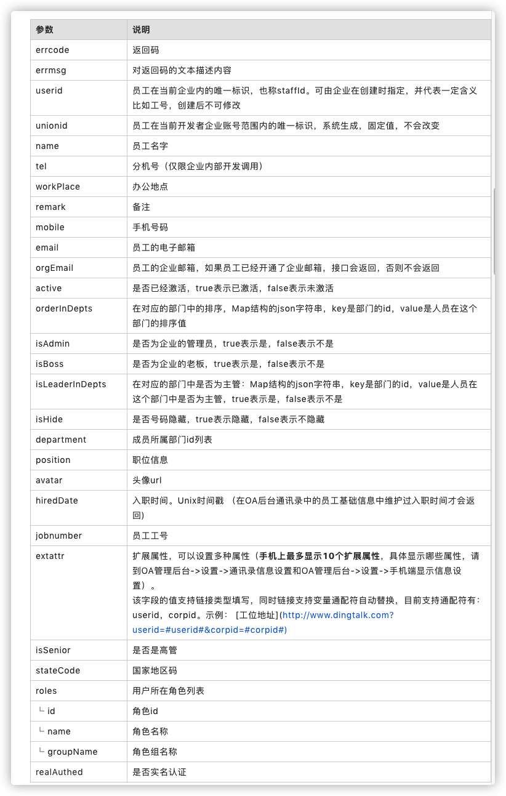

# TrainCenterManageSys

该项目基于 Laravel 用于开发钉钉内部微应用

相关支持来源于 [EasyDingTalk](https://learnku.com/laravel/t/27989)

## 项目运行前提

- 配置 `.env`  数据库链接
- 运行 `composer update`

## 相关公共方法

超级管理员后台管理 - PC端 获取当前用户信息

```php
// 回调页面统一使用如下方法来获取用户信息：
$app = getApp();
$user = $app->oauth->use('app-01')->user();
```

Mobile端 获取当前用户信息

```php
$app = getApp();
$app->user->getUserByCode($code);
```

### 相应返回值

相关返回值请查看 [钉钉开发文档](https://ding-doc.dingtalk.com/doc#/serverapi2/ege851)

常用：

```json
{
    "errcode": 0,
    "unionid": "PiiiPyQqBNBii0HnCJ3zljcxxxxxx",
    "remark": "remark",
    "userid": "zhangsan",
    "isLeaderInDepts": "{1:false}",
    "isBoss": false,
    "hiredDate": 1520265600000,
    "isSenior": false,
    "tel": "xxx-xxxxxxxx",
    "department": [1,2],
    "workPlace": "place",
    "email": "test@xxx.com",
    "orderInDepts": "{1:71738366882504}",
    "mobile": "1xxxxxxxxxx",
    "errmsg": "ok",
    "active": false,
    "avatar": "xxx",
    "isAdmin": false,
    "isHide": false,
    "jobnumber": "001",
    "name": "张三",
    "extattr": {},
    "stateCode": "86",
    "position": "manager",
    "roles": [
        {
            "id": 149507744,
            "name": "总监",
            "groupName": "职务"
        }
    ]
}
```



## 组织架构权限

超级管理员

- 实验室中心主任

管理员

- 借用部门负责人
- 实验室借用管理员
- 实验室中心主任
- 设备管理员

用户

- 普通用户

---

## Helpers方法

```php
getDinginfo($code)
```

入参为 `$code`

返回值为一个包含信息的对象

```json
{
     'name'=>'汤海',
      'tel' =>'12312341234',
      'role'=>'实验室中心主任'
}
```

使用方法：

```php
        $code = 'xxxxx';
        $res  = getDinginfo($code);
        $tel  =  $res->tel;
```

